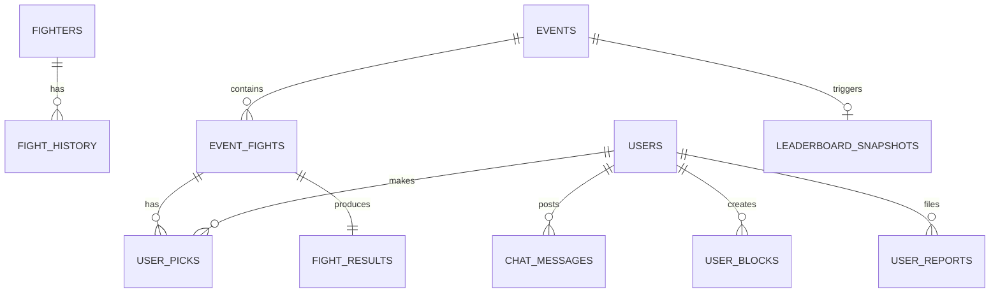

# MMA Matrix Pro

A comprehensive MMA fighter database, fantasy picks platform, and analytics system.

## Technology Stack

| Layer | Technology |
|-------|------------|
| **Frontend** | React 18 + TypeScript + Vite |
| **Styling** | Tailwind CSS + shadcn/ui |
| **Backend** | Express.js + TypeScript |
| **Database** | PostgreSQL |
| **ORM** | Drizzle ORM |
| **Auth** | Replit OIDC + Passport.js |

---

## Frontend Architecture

### Tab-Based SPA

The app uses a **single-page, tab-driven layout** — NOT traditional URL-based routing.

The main shell is `src/pages/Index.tsx` which renders a `Sidebar` and a `renderTabContent()` switch. Each sidebar item sets an `activeTab` state string, and the switch statement renders the corresponding component.

**Only 4 React Router URLs exist:**

| URL | Component | Purpose |
|-----|-----------|---------|
| `/` | `Index.tsx` | Main shell — renders all tabs via sidebar |
| `/fight/:fightId` | `FightDetail.tsx` | Deep-link to fight analysis |
| `/settings` | `Settings.tsx` | Profile, stats, gamification, notifications |
| `/admin/fight-cards` | `AdminFightCards.tsx` | Standalone admin fight management |

### Sidebar → Tab → Component Mapping

**User Tabs (12):**

| Sidebar Label | Tab ID | Component |
|--------------|--------|-----------|
| Dashboard | `dashboard` | `Dashboard` |
| Event Card | `eventcard` | `EventListPage` → `EventCardPage` |
| MMA Metrics Rankings | `rankings` | `MMAMetricsRankings` (leaderboard) |
| Fighter Profiles | `fighters` | `FighterIndex` → `FighterProfile` |
| Event History | `eventhistory` | `EventHistoryPage` |
| News | `news` | `NewsPage` |
| Chat | `chat` | `ChatHub` |
| App Guide | `info` | `InfoTab` |
| Export | `export` | `ExportPage` |
| AI Predictions | `ai-predictions` | `AIPredictionsTab` |
| AI Chat | `ai-chat` | `AIChatTab` |
| Raffle | `raffle` | `RaffleTab` |
| Influencers | `influencers` | `InfluencerTab` |

**Admin Tabs (10):** Create Event, Event Editor, Import, Fighter Manager, Create News, Tag Manager, Badge Manager, Raffle Manager, User Verification, Odds Editor.

> **Audit rule:** Before reporting any page as "missing", verify the sidebar tab ID mapping in `Index.tsx` and the component import. Content pages are rendered via tabs, not URL routes.

---

## Core Gameplay Loop

```
Admin creates Event → Admin adds Fights → Admin sets status to Upcoming
     ↓
Users browse Event Card tab → Users make picks (fighter + method + round + units)
     ↓
Admin sets event to Live → All picks LOCK
     ↓
Admin enters fight results (per-fight) → Points awarded per pick
     ↓
Admin sets event to Closed → Leaderboard snapshot saved
     ↓
Users check their Stats (Settings → My Stats) and Rankings (sidebar)
```

---

## Feature Status

### ✅ Implemented

| Feature | Description |
|---------|-------------|
| Replit OIDC Authentication | Identity-linked auth with Replit profiles |
| Fighter Profiles | Full CRUD with stats, records, performance |
| Fight History Ledger | Immutable fight records with audit trail |
| Event Management | Create/edit events with status lifecycle |
| Pick System | User predictions with locking on event start |
| Scoring Engine | Point calculation on fight result entry |
| Leaderboard | Rankings with snapshots for history |
| Chat System | Global and event-scoped messaging |
| Moderation | Block/mute/report with admin review |
| Tier System | Free/medium/premium feature gating |
| Admin Controls | Protected routes with role enforcement |
| AI Predictions | OpenAI-powered fight analysis (premium) |
| AI Chat | Conversational MMA analyst (premium) |
| News/Blog | Admin-published articles linked to fighters |
| Gamification | Badges, audio cues, visual feedback |
| Raffle | Ticket allocation and draw system |
| Influencer Verification | User verification + featuring |

---

## System Architecture

### Data Flow

```
┌─────────────────┐     ┌─────────────────┐     ┌─────────────────┐
│   Supabase      │     │   Express.js    │     │   React App     │
│   PostgreSQL    │◄────│   API Server    │◄────│   Frontend      │
└─────────────────┘     └─────────────────┘     └─────────────────┘
        │                       │                       │
        ▼                       ▼                       ▼
   Drizzle ORM           Middleware:              React Query
   Schema Sync       - isAuthenticated           Data Fetching
                     - requireAdmin              Tab-based SPA
                     - requireTier
```

### Event Lifecycle

```
Upcoming → Live → Completed → Closed → Archived
    │         │                  │
    │         │                  └── Triggers snapshot
    │         └── Locks all picks
    └── Picks can be created/modified
```

### Scoring Source of Truth

The **canonical scoring path** is `POST /api/fights/:fightId/result` in `fightResultsRoutes.ts`.

When admin enters a fight result:
1. Pick correctness is evaluated (within a DB transaction)
2. Points are awarded per pick
3. User `totalPoints` is recalculated from all picks (not additive)
4. Fighter records updated (JSONB + normalized columns)
5. Fight history entry created

| Prediction | Points |
|------------|--------|
| Fighter correct (moneyline) | +1 |
| Method correct (KO/Sub/Dec) | +3 |
| Round correct | +2 |
| Decision + round correct | +1 (instead of +2) |
| **Maximum per fight** | **6** |

> **Note:** `storage.ts → scoreEventPicks()` also exists as an event-level scoring path triggered on Close. This is identified as a known issue (see audit).

---

## API Reference

### Auth Endpoints

| Method | Endpoint | Auth | Description |
|--------|----------|------|-------------|
| GET | `/api/auth/user` | Bearer | Get current user |

### Fighter Endpoints

| Method | Endpoint | Auth | Description |
|--------|----------|------|-------------|
| GET | `/api/fighters` | None | List all fighters |
| GET | `/api/fighters/:id` | None | Get fighter by ID |
| POST | `/api/fighters` | Auth | Create fighter |
| PUT | `/api/fighters/:id` | Auth | Update fighter |
| DELETE | `/api/fighters/:id` | Auth | Delete fighter |
| POST | `/api/fighters/bulk` | None ⚠️ | Bulk import |
| POST | `/api/fighters/:id/import-history` | Admin | Import fight history |

### Event Endpoints

| Method | Endpoint | Auth | Description |
|--------|----------|------|-------------|
| GET | `/api/events` | None | List all events |
| GET | `/api/events/:id` | None | Get event with fights |
| POST | `/api/events` | Auth | Create event |
| PUT | `/api/events/:id` | None ⚠️ | Update event (missing guard) |
| PUT | `/api/events/:id/status` | Admin | Change status |
| DELETE | `/api/events/:id` | None ⚠️ | Delete event (missing guard) |

### Picks Endpoints

| Method | Endpoint | Auth | Description |
|--------|----------|------|-------------|
| GET | `/api/picks` | Auth | Get user's picks |
| GET | `/api/picks/event/:eventId` | Auth | Get picks for event |
| GET | `/api/picks/fight/:fightId` | Auth | Get pick for fight |
| POST | `/api/picks` | Auth | Create/update pick |
| DELETE | `/api/picks/:fightId` | Auth | Delete pick (if not locked) |

### Fight Results Endpoints

| Method | Endpoint | Auth | Description |
|--------|----------|------|-------------|
| POST | `/api/fights/:fightId/result` | Auth | Enter fight result + score picks |
| GET | `/api/fights/:fightId/result` | None | Get fight result |
| GET | `/api/fights/results` | None | Get all results |

### Leaderboard Endpoints

| Method | Endpoint | Auth | Description |
|--------|----------|------|-------------|
| GET | `/api/leaderboard` | None | Get current rankings |
| GET | `/api/leaderboard/rank/:userId` | None | Get user rank |
| GET | `/api/leaderboard/history` | None | Get historical snapshots |
| GET | `/api/leaderboard/event/:id` | None | Get event-specific snapshot |
| POST | `/api/admin/leaderboard/snapshot` | Admin | Manual snapshot trigger |

### Chat Endpoints

| Method | Endpoint | Auth | Description |
|--------|----------|------|-------------|
| GET | `/api/chat` | None | Get messages |
| POST | `/api/chat` | Auth | Post message |

### News Endpoints

| Method | Endpoint | Auth | Description |
|--------|----------|------|-------------|
| GET | `/api/news` | None | Get published articles |
| GET | `/api/news/:id` | None | Get article by ID |
| POST | `/api/news` | Admin | Create article |
| PUT | `/api/news/:id` | Admin | Update article |
| DELETE | `/api/news/:id` | Admin | Delete article |

### AI Endpoints (Premium Only)

| Method | Endpoint | Auth | Description |
|--------|----------|------|-------------|
| POST | `/api/ai/predict` | Premium | Generate prediction |
| GET | `/api/ai/predictions/:fightId` | Premium | Get cached prediction |
| GET | `/api/ai/event/:eventId/fights` | Premium | Event fights with cache |
| GET | `/api/ai/models` | Premium | List AI models |
| POST | `/api/ai/chat` | Premium | AI chat message |
| GET | `/api/ai/chat/history` | Premium | Chat history |
| DELETE | `/api/ai/chat/history` | Premium | Clear chat history |

### User / Settings Endpoints

| Method | Endpoint | Auth | Description |
|--------|----------|------|-------------|
| GET | `/api/me` | Auth | Get profile |
| PATCH | `/api/me` | Auth | Update profile |
| GET | `/api/me/dashboard` | Auth | Dashboard aggregated data |
| GET | `/api/me/stats` | Auth | Detailed pick statistics |
| GET | `/api/me/settings` | Auth | Gamification settings |
| PUT | `/api/me/settings` | Auth | Update settings |
| GET | `/api/me/badges` | Auth | User badges |
| POST | `/api/me/badges/unlock` | Auth | Unlock badge (client-trigger) |

### Moderation Endpoints

| Method | Endpoint | Auth | Description |
|--------|----------|------|-------------|
| POST | `/api/users/:id/block` | Auth | Block user |
| DELETE | `/api/users/:id/block` | Auth | Unblock user |
| POST | `/api/users/:id/mute` | Auth | Mute user |
| DELETE | `/api/users/:id/mute` | Auth | Unmute user |
| POST | `/api/users/:id/report` | Auth | Report user |
| GET | `/api/admin/reports` | Admin | Get pending reports |
| PATCH | `/api/admin/reports/:id` | Admin | Resolve report |

---

## Database Schema

### Core Tables

| Table | Purpose |
|-------|---------|
| `users` | User accounts with tier, role, totalPoints |
| `fighters` | Fighter profiles with stats, records |
| `events` | Event definitions with status |
| `event_fights` | Fights within events |
| `user_picks` | User predictions with units and isLocked |
| `fight_results` | Official fight outcomes |
| `fight_history` | Immutable fight ledger |

### Gamification Tables

| Table | Purpose |
|-------|---------|
| `user_badges` | Earned badges |
| `user_settings` | Gamification preferences |
| `raffle_tickets` | Raffle entries |

### Social Tables

| Table | Purpose |
|-------|---------|
| `chat_messages` | Event-scoped chat |
| `user_blocks` | Server-enforced blocking |
| `user_mutes` | User-level suppression |
| `user_reports` | Admin review queue |

### Analytics Tables

| Table | Purpose |
|-------|---------|
| `leaderboard_snapshots` | Historical rankings |
| `ai_chat_messages` | AI conversation history |
| `ai_predictions` | Cached fight predictions |
| `news_articles` | Blog/news content |
| `tag_definitions` | Scouting tag types |
| `fighter_tags` | Fighter tag assignments |

---

## Entity Relationships



---

## Tier System

| Tier | Features |
|------|----------|
| `free` | Basic badges, picks, leaderboard |
| `medium` | Custom emojis, extended history |
| `premium` | AI predictions, AI chat, advanced analytics |

```typescript
// Backend route protection
requireTier('premium')         // Blocks users below 'premium' tier
requireFeature('custom_emojis') // Checks feature matrix
```

---

## File Structure

```
├── server/
│   ├── auth/
│   │   ├── supabaseAuth.ts       # JWT middleware (isAuthenticated, requireAdmin)
│   │   └── tierMiddleware.ts     # Tier gating (requireTier, requireFeature)
│   ├── ai/
│   │   └── aiRoutes.ts           # AI prediction endpoints
│   ├── eventRoutes.ts            # Event CRUD + status lifecycle
│   ├── fighterRoutes.ts          # Fighter CRUD + bulk import
│   ├── fightResultsRoutes.ts     # Fight result entry + scoring (canonical)
│   ├── picksRoutes.ts            # User pick CRUD
│   ├── leaderboardRoutes.ts      # Public rankings
│   ├── snapshotRoutes.ts         # Leaderboard history
│   ├── dashboardRoutes.ts        # Dashboard aggregation
│   ├── statsRoutes.ts            # Detailed user stats
│   ├── chatRoutes.ts             # Chat messaging
│   ├── aiChatRoutes.ts           # AI chat (premium)
│   ├── newsRoutes.ts             # News CRUD
│   ├── tagRoutes.ts              # Fighter tags
│   ├── badgeRoutes.ts            # Badge management
│   ├── raffleRoutes.ts           # Raffle system
│   ├── moderationRoutes.ts       # Block/mute/report
│   ├── adminRoutes.ts            # Admin debug + event ops
│   ├── adminManagementRoutes.ts  # Badge/odds admin
│   ├── verificationRoutes.ts     # User verification
│   ├── storage.ts                # Database operations (legacy scoring)
│   ├── roiCalculator.ts          # ROI math (American odds)
│   └── index.ts                  # Server entry
├── shared/
│   ├── schema.ts                 # Drizzle table definitions (fighters, events, tags)
│   └── models/
│       └── auth.ts               # User/picks/moderation/badge tables
├── src/
│   ├── pages/
│   │   ├── Index.tsx             # Main SPA shell (tab renderer)
│   │   ├── FightDetail.tsx       # Fight deep-link page
│   │   ├── Settings.tsx          # User settings + My Stats
│   │   ├── AdminFightCards.tsx    # Admin fight management
│   │   └── NotFound.tsx          # 404 page
│   ├── components/
│   │   ├── layout/               # Sidebar, Header
│   │   ├── dashboard/            # Dashboard widgets
│   │   ├── event/                # EventListPage, EventCardPage, EventHeader
│   │   ├── eventhistory/         # EventHistoryPage
│   │   ├── fighter/              # FighterIndex, FighterProfile, FighterCard
│   │   ├── fightdetail/          # FighterComparisonCard, FantasyPickSection
│   │   ├── rankings/             # MMAMetricsRankings, RankingRow
│   │   ├── news/                 # NewsPage, NewsCard
│   │   ├── chat/                 # ChatHub, EventChat
│   │   ├── ai/                   # AIPredictionsTab
│   │   ├── aichat/               # AIChatTab
│   │   ├── raffle/               # RaffleTab
│   │   ├── influencers/          # InfluencerTab
│   │   ├── export/               # ExportPage
│   │   ├── import/               # ImportPage
│   │   ├── gamification/         # Sound, badges, visual feedback
│   │   ├── settings/             # MyStatsTab
│   │   ├── tags/                 # FighterTagsSection
│   │   ├── admin/                # All admin components (10 files)
│   │   └── ui/                   # shadcn/ui primitives (52 files)
│   ├── context/                  # AuthContext, FighterDataContext, GamificationContext
│   ├── hooks/                    # use-auth, useFighters, etc.
│   └── App.tsx                   # React Router (4 URL routes only)
└── drizzle.config.ts
```

---

## Development

```bash
# Install dependencies
npm install

# Set up environment variables
cp .env.example .env
# Edit .env with your Supabase credentials

# Push schema to database
npx drizzle-kit push

# Start development server
npm run dev
```

### Environment Variables

```env
SUPABASE_URL=https://your-project.supabase.co
SUPABASE_ANON_KEY=your-anon-key
SUPABASE_SERVICE_ROLE_KEY=your-service-key
VITE_SUPABASE_URL=https://your-project.supabase.co
VITE_SUPABASE_ANON_KEY=your-anon-key
DATABASE_URL=postgresql://...
SESSION_SECRET=your-secret
OPENAI_API_KEY=sk-...
```

---

## Admin Operations

### Changing Event Status

```bash
PUT /api/events/:id/status
Body: { "status": "Live" }

# Status transitions:
# Upcoming → Live (locks picks)
# Live → Completed
# Completed → Closed (triggers snapshot)
# Closed → Archived
```

### Entering Fight Results

```bash
POST /api/fights/:fightId/result
Body: {
  "winnerId": "fighter-uuid",
  "method": "KO/TKO",
  "roundEnd": 2,
  "timeEnd": "3:45"
}
# Automatically scores all picks for this fight
```

### Manual Leaderboard Snapshot

```bash
POST /api/admin/leaderboard/snapshot
Body: { "type": "monthly" }
```

## Stripe Integration

The system now supports Stripe for payment processing.

### Environment Variables
The following environment variables are required:
- `STRIPE_SECRET_KEY`: Your Stripe secret key (`sk_test_...`).
- `STRIPE_WEBHOOK_SECRET`: Your Stripe webhook signing secret (`whsec_...`).

### Webhook Setup
The webhook endpoint is located at `/api/webhooks/stripe`. It supports:
- `checkout.session.completed`: Handles successful checkout completions.
- `payment_intent.succeeded`: Tracks successful payment intents.

#### Local Testing
To test webhooks locally:
1. Install the [Stripe CLI](https://stripe.com/docs/stripe-cli).
2. Run `stripe login`.
3. Start forwarding webhooks:
   ```bash
   stripe listen --forward-to localhost:3001/api/webhooks/stripe
   ```
4. Copy the signing secret provided by the CLI and add it to your environment as `STRIPE_WEBHOOK_SECRET`.
